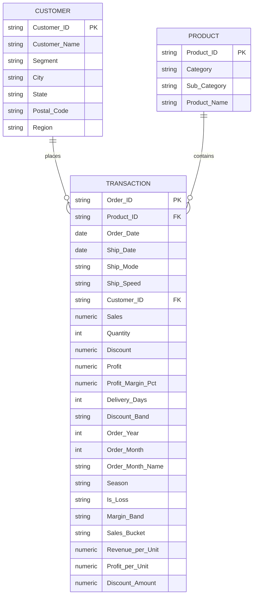

# Retail Sales Analytics — End-to-End Business Intelligence Project

> A complete data analytics project covering Python data engineering, SQL database design, and Power BI dashboard development on 4 years of US retail sales data.

---

##  Project Overview

**Project Title:** Retail Sales Analytics
**Tools:** Python (pandas) · SQL (PostgreSQL) · Power BI · DAX

---

##  Problem Statement

Retail businesses operating across multiple product categories, regions, and customer segments often lack visibility into what is actually driving or eroding profitability. Despite growing revenue year over year, a significant portion of orders can be loss-making, and management cannot pinpoint whether the issue lies in pricing strategy, discounting behaviour, geographic underperformance, or customer mix. Without a centralized analytics solution, business decisions are made on incomplete information — making it impossible to prioritize corrective action, optimize discount policies, or allocate resources effectively across regions and product lines.

---

##  Repository Structure

```
retail-sales-analytics/
│
├── data/
│   ├── Sample_Superstore.csv        ← raw source data
│   ├── customer_data.csv            ← cleaned dimension table
│   ├── product_data.csv             ← cleaned dimension table
│   └── transaction_data.csv         ← cleaned fact table
│   └── supertore_clean.csv         ← cleaned fact table
│
├── python/
│   └── sales.ipynb                  ← data cleaning + feature engineering
│
├── sql/
│   └── sales.sql                    ← database design + 27 business queries
│
├── dashboard/
│   └── superstore_dashboard.pbix    ← 6-page Power BI dashboard
│
├── screenshots/
│   ├── page1_overview.png
│   ├── page2_product.png
│   ├── page3_regional.png
│   ├── page4_discount.png
│   ├── page5_customer.png
│   └── page6_trends.png
│
└── README.md
```

---

##  Dataset Overview

| Metric | Value |
|--------|-------|
| Time Period | 2014 — 2017 |
| Total Revenue | $2.30M |
| Total Profit | $286K |
| Overall Margin | 12.47% |
| Total Orders | 5,009 |
| Unique Customers | 793 |
| Unique Products | 1,862 |
| Loss Order Rate | 18.72% |

**Three normalized tables:**
- `customer_table` — 793 customers with segment, city, state, region
- `product_table` — 1,862 products with category and sub-category
- `transaction_table` — 9,994 order lines with 23 columns

---

##  Entity Relationship Diagram (ERD)



---

##  Step 1 — Python: Data Cleaning & Feature Engineering

**File:** `python/sales.ipynb`

### Workflow
```
Raw CSV → Column Standardization → Data Type Fixes → 
Pre-Clean Validation → Cleaning → Feature Engineering → 
Pre-Split Validation → Table Split → Post-Split Validation → Export
```

### Data Cleaning Steps
- Standardized column names — replaced spaces and hyphens with underscores
- Fixed data types — `Order_Date`, `Ship_Date` converted to datetime, `Postal_Code` to string
- Removed duplicate rows on `(Order_ID, Product_ID)`
- Standardized text columns — strip whitespace, title case
- Removed invalid discounts (outside 0–1 range)
- Removed zero or negative sales
- Dropped rows with null critical fields

### Validation Steps
| Validation | When | What it checks |
|------------|------|----------------|
| Pre-Clean | Before cleaning | Negative sales, invalid discounts, ship before order date |
| Pre-Split | Before splitting | Customers with multiple cities or segments |
| Post-Split | After splitting | Unmatched IDs, negative delivery days, nan band values |

### Feature Engineering — 12 Derived Columns

| Column | Description | Formula |
|--------|-------------|---------|
| `Profit_Margin_Pct` | Profit as % of sales | Profit / Sales × 100 |
| `Delivery_Days` | Days from order to ship | Ship_Date − Order_Date |
| `Discount_Band` | Discount category | No Discount / Low / Medium / High |
| `Order_Year` | Year of order | Order_Date.year |
| `Order_Month` | Month number | Order_Date.month |
| `Order_Month_Name` | Month abbreviation | Order_Date.strftime('%b') |
| `Season` | Season of order | Month → Winter/Spring/Summer/Fall |
| `Is_Loss` | Loss flag | Profit < 0 → Loss, else Profit |
| `Margin_Band` | Margin category | Loss / Low / Medium / High |
| `Sales_Bucket` | Order size category | Micro / Small / Medium / Large / XL |
| `Revenue_per_Unit` | Revenue per unit | Sales / Quantity |
| `Profit_per_Unit` | Profit per unit | Profit / Quantity |
| `Discount_Amount` | Discount in dollars | Sales × Discount |
| `Ship_Speed` | Shipping speed label | Express / Fast / Standard / Economy |

### Output
Four CSV files exported:
- `transaction_data.csv` → SQL project + Power BI
- `customer_data.csv` → SQL project + Power BI
- `product_data.csv` → SQL project + Power BI
- `superstore_clean.csv` → Power BI direct connection

---

##  Step 2 — SQL: Database Design & Business Queries

**File:** `sql/sales.sql`

### Database Design
- 3 normalized tables with foreign key constraints
- Composite primary key on transaction_table (Order_ID, Product_ID)
- CHECK constraints on Sales (> 0) and Quantity (> 0)
- NULLIF protection throughout all division operations

### Indexes (8 total)
```sql
CREATE INDEX idx_product_id    ON transaction_table (Product_ID);
CREATE INDEX idx_customer_id   ON transaction_table (Customer_ID);
CREATE INDEX idx_order_date    ON transaction_table (Order_Date);
CREATE INDEX idx_order_year    ON transaction_table (Order_Year);
CREATE INDEX idx_region        ON customer_table    (Region);
CREATE INDEX idx_category      ON product_table     (Category);
CREATE INDEX idx_segment       ON customer_table    (Segment);
CREATE INDEX idx_discount_band ON transaction_table (Discount_Band);
```

### Reusable View
```sql
CREATE VIEW sales_summary AS
SELECT ft.*, dc.Customer_Name, dc.Segment, dc.City, dc.State, dc.Region,
       dp.Category, dp.Sub_Category, dp.Product_Name
FROM transaction_table ft
JOIN customer_table dc ON ft.Customer_ID = dc.Customer_ID
JOIN product_table  dp ON ft.Product_ID  = dp.Product_ID;
```

### Stored Function
```sql
-- Dynamically returns category data for any region
CREATE OR REPLACE FUNCTION get_region_sales(p_region VARCHAR)
RETURNS TABLE (
    Category     VARCHAR,
    Sub_Category VARCHAR,
    Sales        NUMERIC,
    Profit       NUMERIC,
    Discount     NUMERIC
) LANGUAGE plpgsql
```

### 27 Business Queries Across 6 Sections

| Section | Queries | Business Question |
|---------|---------|------------------|
| Executive Overview | Q1–Q3 | Is the company profitable or just growing revenue? |
| Product Profitability | Q4–Q10 | Which products make money and which destroy margin? |
| Regional & State | Q11–Q14 | Where is the business winning and bleeding? |
| Discount & Margin | Q15–Q18 | Is discounting driving growth or destroying profit? |
| Customer Intelligence | Q19–Q22 | Who are the best customers and how loyal is the base? |
| Time & Seasonal Trends | Q23–Q27 | When does the business peak and is growth sustainable? |

### SQL Techniques Demonstrated

| Technique | Used In |
|-----------|---------|
| CTEs (`WITH` clause) | Q2, Q10, Q12, Q22, Q23 |
| Window Functions (`LAG`, `RANK`, `SUM OVER`, `PARTITION BY`) | Q2, Q10, Q12, Q14, Q24, Q25 |
| Aggregate Functions with FILTER | Q1, Q4, Q9, Q11 |
| NULLIF for division safety | All division operations |
| Stored Function (plpgsql) | get_region_sales() |
| Reusable View | Q4, Q6, Q11 |
| HAVING clause | Q7 |
| CASE WHEN | Q12, Q21, Q22 |
| DATE_TRUNC | Q23, Q24 |
| Foreign Key Constraints | Schema design |
| Composite Primary Key | transaction_table |

---

##  Step 3 — Power BI: Interactive Dashboard

**File:** `dashboard/superstore_dashboard.pbix`

### DAX Measures — Key Patterns

**YoY Growth Pattern:**
```dax
YoY Revenue Growth % =
VAR CurrentYear = SELECTEDVALUE(superstore_clean[Order_Year])
VAR CurrentRevenue = CALCULATE([Total Revenue])
VAR PrevRevenue = CALCULATE(
    [Total Revenue],
    ALL('Date Table'),
    superstore_clean[Order_Year] = CurrentYear - 1
)
RETURN
IF(
    ISBLANK(CurrentYear) || ISBLANK(PrevRevenue),
    BLANK(),
    DIVIDE(CurrentRevenue - PrevRevenue, PrevRevenue, 0)
)
```

**Arrow Display Pattern:**
```dax
YoY Growth =
VAR yoy = [YoY Revenue Growth %]
RETURN
IF(
    ISBLANK(yoy), "--",
    IF(
        yoy > 0, "▲ " & FORMAT(yoy, "0.0%"),
        IF(yoy < 0, "▼ " & FORMAT(ABS(yoy), "0.0%"), "— 0.0%")
    )
)
```

**Dynamic Best Month:**
```dax
Best Month =
VAR MonthTable =
    ADDCOLUMNS(
        VALUES(superstore_clean[Order_Month_Name]),
        "Revenue", CALCULATE([Total Revenue])
    )
RETURN
MAXX(
    TOPN(1, MonthTable, [Revenue], DESC),
    superstore_clean[Order_Month_Name]
)
```

### Dashboard Pages

### Page 1 — Executive Overview
**Business Question:** Is the company healthy — profitable, growing, and operationally efficient?


**KPIs:** Total Revenue, Total Profit, Total Orders, Profit Margin %, Loss Rate % — all with YoY growth indicators (▲/▼)

**Key Visuals:**
- Category combo chart — Furniture margin at 1.77% vs Technology 20.58%
- Region combo chart — South margin 11.61% vs East 13.49%
- Monthly revenue trend — Nov and Dec always peak
- Segment combo chart — Home Office leads margin at 16.54%

---

### Page 2 — Product Profitability
**Business Question:** Which products make money and which destroy margin?


**Key Visuals:**
- Treemap — Furniture commands revenue share but delivers least profit
- Waterfall chart — Tables and Bookcases drag Furniture into loss territory
- Matrix table — conditional formatting on Margin % and Avg Discount %
- Sales Bucket combo — XL orders drive most profit

---

### Page 3 — Regional & State Performance
**Business Question:** Where is the business winning and bleeding geographically?


**Key Visuals:**
- Top 10 States — New York and California anchor 41% of profit
- Bottom 5 Loss States — Ohio and Pennsylvania biggest drains
- Treemap — West and East dominate, South and Central lag
- Matrix — Pennsylvania -19.02% and Ohio -34.14% margin in red

---

### Page 4 — Discount & Margin Analysis
**Business Question:** Is discounting driving growth or systematically destroying profit?


**Key Visuals:**
- Scatter plot — Tables and Bookcases bottom right (high discount, negative margin)
- Hero chart — margin crashes from +30.4% (No Discount) to -100% (High Discount)
- Stacked bar — Furniture receives most high-discount orders proportionally
- Sub-category margin bar — Tables and Bookcases only loss-making sub-categories

---

### Page 5 — Customer Intelligence
**Business Question:** Who are the best customers and which segments are most valuable?


**Key Visuals:**
- Top 10 Customers by Profit bar chart
- Scatter plot — Revenue vs Profit Margin % with break-even line
- Segment combo — Home Office smallest but leads margin at 16.54%
- Sales Bucket combo — XL orders most profitable per customer

---

### Page 6 — Time & Seasonal Trends
**Business Question:** When does the business peak and is growth sustainable?


**Key Visuals:**
- 4-year monthly trend — consistent growth with Nov/Dec peaks every year
- Annual YoY combo — all 4 years always visible
- Monthly order count — November and December lead all months
- Season combo — Fall leads, Winter weakest at 7.19% margin

---

## 🔑 Key Business Insights

### 1. Discounting is the #1 profit killer
- No-discount orders earn **29.5% margin**
- High-discount (41%+) orders lose **89.56% margin**
- Every order above **20% discount** destroys value

### 2. Furniture is a revenue trap
- $742K revenue but only **2.48% margin**
- Tables lose **$17.7K** driven by 26% average discount
- Bookcases lose **$3.5K** driven by 22% average discount

### 3. Geographic performance gap
- East leads at **15.5% margin**
- South at **7.5%** — half of East
- Ohio (-34.14%) and Pennsylvania (-19.02%) are biggest loss states

### 4. High revenue ≠ high profit customers
- Top revenue customers are not always profitable
- Home Office smallest segment but leads margin at **16.54%**
- Consumer segment largest revenue but lowest margin at **10.68%**

### 5. Customer loyalty is exceptional
- **98.49% repeat customer rate**
- Growth challenge is margin improvement not customer acquisition

### 6. Seasonal concentration risk
- **Fall drives 37% of annual revenue**
- November and December consistently peak across all 4 years
- Winter margin drops to **7.19%** — lowest of all seasons

---

##  How to Run

### Python
1. Install dependencies:
```bash
pip install pandas numpy
```
2. Place `Sample_Superstore.csv` in the `/data` folder
3. Open `python/sales.ipynb` in Jupyter Notebook or VS Code
4. Update file path if needed and run all cells
5. Three cleaned CSVs will be exported to `/data`

### SQL
1. Install PostgreSQL
2. Create a new database:
```sql
CREATE DATABASE superstore;
```
3. Run the SQL file:
```bash
psql -d superstore -f sql/sales.sql
```
4. Load CSVs from `/data` folder into respective tables

### Power BI
1. Download Power BI Desktop (free) from microsoft.com
2. Open `dashboard/superstore_dashboard.pbix`
3. Update data source path to your local `/data` folder
4. Refresh data — all visuals and DAX measures load automatically

---

## 👤 Author

**Rajveer**
- 📧 [rajveerpatil759@gmail.com]
- 💼 [your LinkedIn]


---

## 📄 License

This project is for portfolio and educational purposes.
Data source: Superstore Sales Dataset (publicly available sample retail dataset)
